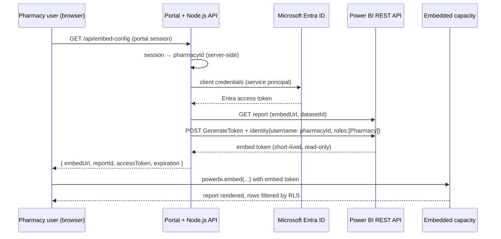

# Power BI Embedded Dashboard Suite · Pharmacy Sell-out

Reference implementation behind the **Power BI Embedded Dashboard Suite** case study
(`/case-studies/powerbi-embedded-pharmacy`). One Power BI report, published once, embedded
in a pharmacy web portal. Every pharmacy only sees its own sell-out data, enforced by
**row-level security (RLS)** keyed on the pharmacy ID.

> The client is anonymized. Identifiers, pharmacy IDs and sample numbers in this folder are illustrative.

```
projects/powerbi-embedded-suite/
├── README.md                ← this document: diagnosis → design → build → operate
├── server/                  ← Node.js token API (Express + MSAL)
│   ├── .env.example
│   ├── package.json
│   └── src/
│       ├── config.js        ← validated env config
│       ├── auth.js          ← session → pharmacy ID (trusted, server-side)
│       ├── powerbi.js       ← Entra token, report metadata, GenerateToken + RLS identity
│       └── index.js         ← GET /api/embed-config
├── web/
│   └── embed.html           ← powerbi-client embed page with token auto-refresh
├── mockup/
│   └── pharmacy-sellout-mockup.html ← stand-alone interactive replica of the report (sample data)
└── powerbi/
    ├── measures.dax         ← Sell-out Units/Value, YTD, PY, YoY %, ranking
    ├── rls-role.dax         ← "Pharmacy" role: [PharmacyId] = USERPRINCIPALNAME()
    └── theme.json           ← report theme using the site's palette
```

---

## 1. Diagnosis: why embedded, and why this setup

**What the business asked for.** Each pharmacy in the network wanted to see its own
sell-out numbers (units and value, by product and by month, year to date and against the
previous year) inside the portal it already logs into. They did not want another tool,
login or licence.

**What was happening before.** Reports were exported and emailed per pharmacy. That meant
manual effort every month, numbers that were out of date as soon as they were sent, and a
real risk of sending one pharmacy another pharmacy's data.

**Options we looked at:**

| Option | Why it was rejected / chosen |
|---|---|
| Share reports in the Power BI service | Every pharmacy user needs a Pro/PPU licence **and** an Entra ID account. Cost grows with users and onboarding is heavy. ✗ |
| *Publish to web* | Public URL, no authentication and no RLS. Not acceptable for commercial data. ✗ |
| **Embed for your organization** (user owns data) | Users still sign in with Entra ID and need licences. ✗ |
| **Embed for your customers** (app owns data) + RLS | The portal authenticates users itself. A service principal generates short-lived tokens. Pharmacy users need **no Power BI licence**. One report serves all pharmacies. ✓ |

**One report with RLS, not one report per pharmacy.** The alternative, a copy of the report
for each pharmacy with a lookup table of report IDs, means N reports to publish, keep in sync
and version. With RLS there is a single report and a single semantic model. The token is
the only thing that changes, and adding a pharmacy only needs a new row in `DimPharmacy`.

---

## 2. Architecture



Key properties:

- **The secret never reaches the browser.** The browser only receives a read-only embed
  token scoped to one report and one RLS identity.
- **The pharmacy ID is never chosen by the client.** It comes from the authenticated portal
  session (`server/src/auth.js`). If the client could send it, RLS would not protect anything.
- **Tokens are refreshed silently.** `report.setAccessToken()` is called 5 minutes before the
  token expires, so users can keep a dashboard open all day without reloading it.

---

## 3. Azure and Power BI setup (step by step)

1. **Register the app in Microsoft Entra ID**
   Entra admin center → App registrations → *New registration* (single tenant, no redirect URI).
   Note the **Tenant ID** and **Client ID**. Create a **client secret**, or a certificate for
   production, and store it in Key Vault or App Service settings, never in git.
   No Power BI API permissions need admin consent when you authenticate as a service principal.

2. **Create a security group** (e.g. `sg-powerbi-embed`) and add the app's service principal to it.

3. **Power BI tenant settings** (Admin portal → Tenant settings), scoped to that group:
   - *Service principals can use Fabric APIs* (formerly "Allow service principals to use Power BI APIs")
   - *Embed content in apps*

4. **Workspace.** Create a dedicated workspace (e.g. `WS-Pharmacy-Sellout-PROD`) and add the
   service principal as **Member** (Admin also works; Viewer is not enough to generate tokens).

5. **Capacity.** Assign the workspace to an embedded capacity. An **A-SKU** (Power BI Embedded
   in Azure) or a **Fabric F-SKU** both support app-owns-data. Size it from load tests. Dev and
   test capacities can be paused outside working hours through the Azure portal or ARM API to
   save cost.

6. **Publish** the report (built on the model in section 4) to the workspace. Note the
   **Workspace ID** and **Report ID** from the URL:
   `app.powerbi.com/groups/<workspaceId>/reports/<reportId>`.

---

## 4. Semantic model and RLS

Star schema (Import mode, fed from the Gold layer):

| Table | Grain / keys |
|---|---|
| `FactSellOut` | one row per day × pharmacy × product: `DateKey`, `PharmacyId`, `ProductId`, `Units`, `NetValue` |
| `DimDate` | marked as date table; Year, Month, MonthName, YearMonth |
| `DimProduct` | `ProductId`, Product, Category, Brand |
| `DimPharmacy` | `PharmacyId`, Name, Region |

- Measures are in [`powerbi/measures.dax`](powerbi/measures.dax): Sell-out Units, Sell-out
  Value, YTD, prior year, YoY %, product rank.
- RLS role **`Pharmacy`** on `DimPharmacy` is in [`powerbi/rls-role.dax`](powerbi/rls-role.dax):

  ```dax
  [PharmacyId] = USERPRINCIPALNAME()
  ```

  When a token carries an effective identity, `USERPRINCIPALNAME()` returns that identity's
  `username`, which is the pharmacy ID sent by the API.
- Test in Desktop with *Modeling → View as → Other user = PH-001 + role Pharmacy*.
- Report pages: **Overview** (KPI cards for Units, Value, Value YTD and YoY %; monthly trend
  of this year against last year), **Products** (top products by value, units against value),
  **Monthly detail** (matrix of product × month).
- Theme: [`powerbi/theme.json`](powerbi/theme.json) (View → Themes → Browse). It uses the
  site's colours. Power BI only renders fonts installed on the viewer's machine, so the theme
  uses Segoe UI instead of the site's Google fonts.

---

## 5. Node.js token API

```bash
cd server
cp .env.example .env      # fill in tenant, client, secret, workspace, report
npm install
npm run dev               # http://localhost:3000
```

`GET /api/embed-config` with `Authorization: Bearer <portal session>` returns:

```json
{
  "reportId": "…", "reportName": "Pharmacy Sell-out", "embedUrl": "https://app.powerbi.com/reportEmbed?...",
  "accessToken": "H4sI…", "expiration": "2026-09-22T21:45:00Z", "pharmacyId": "PH-001"
}
```

The core call (`server/src/powerbi.js`):

```js
await pbiFetch('/GenerateToken', {
  method: 'POST',
  body: JSON.stringify({
    datasets: [{ id: report.datasetId }],
    reports:  [{ id: report.id, allowEdit: false }],
    identities: [{ username: pharmacyId, roles: ['Pharmacy'], datasets: [report.datasetId] }],
  }),
})
```

## 6. Front end (HTML + powerbi-client)

Open `http://localhost:3000/embed.html?session=demo-token-farmacia-001`. Try
`demo-token-farmacia-002` to confirm that a different pharmacy sees different rows from the
same report.

The embed config uses `TokenType.Embed` and `Permissions.Read`, hides the filter pane (RLS
already scopes the data) and uses a transparent background so the report sits on the portal's
dark theme.

---

### Interactive mockup

`mockup/pharmacy-sellout-mockup.html` is a self-contained replica of the embedded report for
demos and the case-study page. It has the portal chrome, slicers, KPI cards, a CY vs PY line,
cross-filtering category bars, top products, a sortable product table, a monthly matrix, page
tabs and a filters pane. Switching the signed-in pharmacy shows what RLS does. All data in it
is generated sample data.

## 7. Security checklist

- [ ] Secret or certificate stored in Key Vault / App Service settings and rotated on a schedule
- [ ] Pharmacy ID resolved server-side from the session and never read from query or body
- [ ] RLS role tested with *View as* for at least two pharmacies, plus a user with no pharmacy (must get 403)
- [ ] Embed token: `allowEdit: false` and a single report and dataset
- [ ] `Cache-Control: no-store` on the token endpoint
- [ ] CORS limited to the portal origin
- [ ] Service principal is Member (not Admin) of only this workspace

## 8. Operating it

- **Capacity metrics app**: watch CPU and overloads per report page and scale the SKU from real usage.
- **Deployments**: Dev → Test → Prod workspaces through deployment pipelines. Only
  `PBI_WORKSPACE_ID` / `PBI_REPORT_ID` change per environment.
- **Failure tracing**: the API logs the Power BI `requestid` header of failed calls.
- **Onboarding a pharmacy**: add it to `DimPharmacy` and link its portal users to its ID. No report change is needed.
